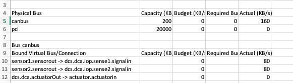
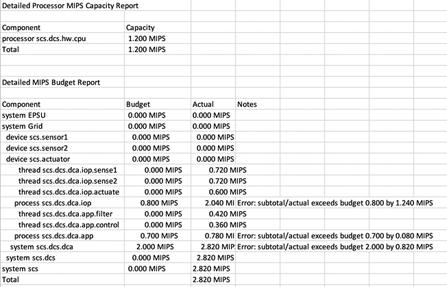

# Resource Budget Analysis Example
This example illustrates weight analysis, electrical power analysis, and computer hardware budget analysis.

## Doing the Analysis ##

Start by instantiating both:

- System Impl MySystem.Tier0 &nbsp; -- includes weight and power
- System Impl MySystem.Tier2 &nbsp; -- adds processor and bus

Do this by right clicking on the appropriate system implementation in the Outline view and selecting "instantiate". If it doesn't already exist an "instances" folder will be created in the project with the two instances ending in .aaxl2.

All of the analyses in this example are accomplished by right clicking on one of the instances and selecting "Analyses" from the dropdown menu and then selecting the desired analysis under "Budget". All of these analyses produce results in either comma delimited or Excel files (or both). The Problems tab will also show issues in the analysis.

The OSATE help system has documentation that is useful for this example. Navigate from the Help menu to Help->Help Contents->OSATE Core Documentation. Open that up and then open Model Analyses and select Other Analyses. There you will find more information about each of the analyses in this example.

### Weight Analysis ###

 
To do a weight analysis select "Calculate Weight Totals" as the analysis method. The results will appear in a "WeightAnalysis" folder within the "Instances" folder. The bottom line of the analysis report for the tier0 instance should show:

*MySystem_Tier0_Instance: [A] Sum of weights (2.760 kg) is below weight limit of 3.000 kg (8.0 % Weight slack)*

The Problems tab will show three warnings which can be ignored as they have to do with weight limits of abstract items as shown in the report.

The report for the tier2 instance should show:

*ERROR:  MySystem_Tier2_Instance: [A] Sum of weights (3.360 kg) exceeds weight limit of 3.000 kg*

The analysis shows that the selected components are too heavy given the systen requirements. This error also shows up in the Problems tab.

## Electrical Power Analysis #

Use "Analyze Power Requirements" to do this analysis and the results will appear in the "Power" folder within "instances". For the tier0 system, the bottom line of the resulting report says:

*budget total 2.5 W within supply 40.0 W*

and there are no entries under the Problems tab.

For the tier2 system, the report will say: 

*budget total 4.1 W within supply 40.0 W*

with two warnings in the Problems tab that are inconsequential.

## Computer Hardware Budget Analysis ##

Because the tier0 system does not contain processor or bus information it is only profitable to run this analysis on the tier2 system. Here is a summary of what should result.

### Bus Load ##

While the tier2 system specifies bus bindings, it does not specify a budget for either of the pci or canbus bus. The result of running "Analyze Bus Load" is:

### Not Bound Resources ###

The result of running "Analyze Resource Budget (Not Bound)" on the tier2 system is a .csv report that includes errors:

### Bound Resources ###

The result of running "Analyze Resource Allocation (Bound)" on the tier2 system is a .csv report that includes an error:

7/2/2020
